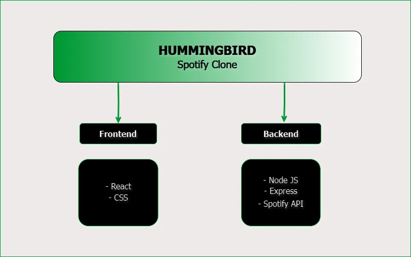

# :musical_note:  Hummingbird | Spotify Clone
 
 

## :floppy_disk: Versión actual

* 0.1.0 | (19/5/2024)

 

## :eyes: Descripción

Hummingbird es una aplicación web fullstack, creada como un clon de la plataforma digital de distribución de música denominada Spotify. Fue desarrolada con React en el frontend y Node.js con Express en el backend. Esta aplicación uitliza la propia API de Spotify para brindar acceso a los datos almacenados en la base de datos de la plataforma, que incluyen información sobre los tracks, los álbumes, los artistas, los usuarios y las playlists, entre otras cosas.

Hummingbird es un proyecto personal, creado sin ningún fin de lucro y que no pretende infringir ninguna ley de copyright, siendo únicamente un ejercicio educativo y de aprendizaje.

El propósito de este repositorio y el de esta aplicación, es educacional y de prueba. No se admite su uso de forma comercial.

 

## :rocket: Deploy

 

## :pencil:  Features

 

## :book: Documentación

 

## :wrench: Instalación

 

## :desktop_computer: Ejecución

 

## :test_tube: Testing

 

## :file_folder: Estructura del proyecto

 

## :file_folder: Arquitectura del servidor

 

## :bust_in_silhouette: Autor

Esta aplicación web fue desarrollada por Marcelo Dutto, egresado de la carrera Full-Stack Developer en Coderhouse.

Para ver el perfil de github, siga [este](https://github.com/MarceloDutto) enlace.

Para conectar a través de linkendin, presione [aquí](https://www.linkedin.com/in/marcelodutto/).
